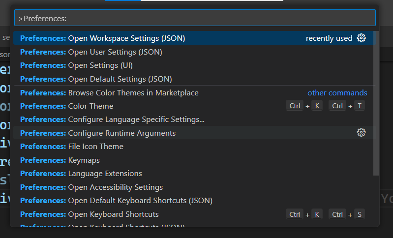

## ESLint: Integrating with Your Workflow

https://eslint.org/docs/latest/rules/

### To run eslint by adding in script

```json
"scripts": {
    "lint": "eslint src"
  },
```

### Integrating ESLint with webpack

https://webpack.js.org/
https://webpack.js.org/loaders/

- npm install eslint-loader --save-dev

https://github.com/webpack-contrib/eslint-loader

https://github.com/LinkedInLearning/eslint-workflow-2254050/wiki/01_03-Integrating-ESLint-with-webpack

### Use ESLint in an editor

https://eslint.org/docs/latest/use/integrations

open command pallette(ctrl+shift+p) > type `>preferences:` > select the `Open Workspace Settings(JSON)`


Add the code from below link

https://github.com/LinkedInLearning/eslint-workflow-2254050/wiki/01_04-Using-ESLint-in-an-editor

Next Steps:
Checkout the other courses

- Customizing ESLint rules
- JavaScript best practices
- webpack
